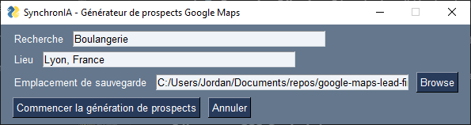
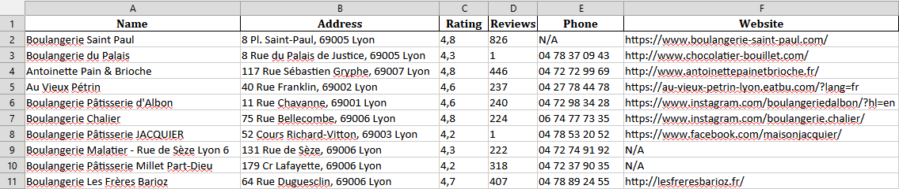
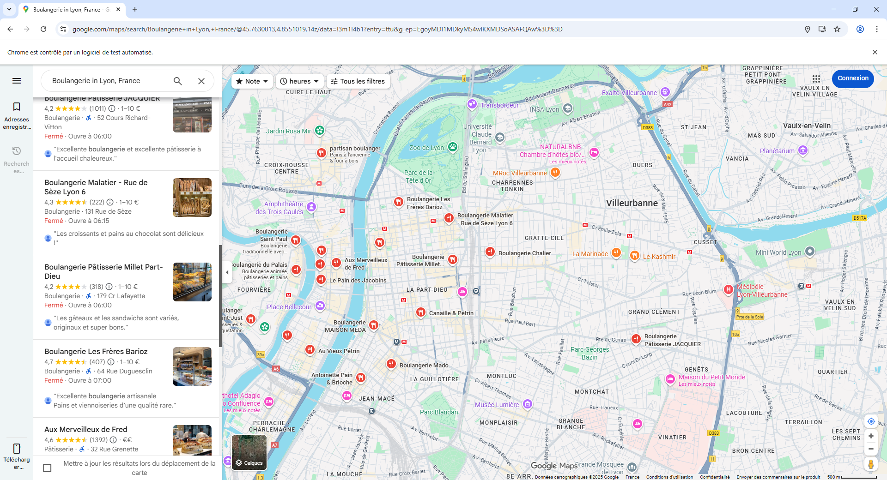

  <div align="center">
    <a href="https://synchronia.fr?utm_source=github&utm_medium=readme&utm_campaign=easy-leads&utm_content=logo">
      
    </a>
  </div>

# 🗺️ Easy Leads

**Un outil d'automatisation professionnel pour l'extraction de données Google Maps**

*Développé par [SynchronIA](https://synchronia.fr?utm_source=github&utm_medium=readme&utm_campaign=easy-leads&utm_content=tagline) - Experts en RPA, Intelligence Artificielle et Automatisation*

---

<!-- 
*Placeholder pour GIF : Démonstration complète de l'utilisation de l'outil* -->

## 📋 Table des Matières

- [🎯 Objectifs](#-objectifs)
- [✨ Fonctionnalités](#-fonctionnalités)
- [🖥️ Interface Utilisateur](#️-interface-utilisateur)
- [📊 Exemple de Résultat](#-exemple-de-résultat)
- [🚀 Installation](#-installation)
- [📝 Utilisation](#-utilisation)
- [🔧 Architecture Technique](#-architecture-technique)
- [⚖️ Considérations Légales](#️-considérations-légales)
- [🏢 À Propos de SynchronIA](#-à-propos-de-synchronia)
- [🤝 Support et Développement](#-support-et-développement)

## 🎯 Objectifs

**Easy Leads** est un outil d'automatisation RPA (Robotic Process Automation) conçu pour extraire efficacement les informations commerciales depuis Google Maps. Il permet aux professionnels, marketeurs et entrepreneurs de :

- **Générer des listes de prospects qualifiés** en quelques clics
- **Automatiser la collecte de données commerciales** (nom, adresse, téléphone, site web, avis)
- **Exporter directement en Excel** pour un traitement immédiat
- **Économiser des heures de recherche manuelle** grâce à l'automatisation intelligente

### Cas d'Usage Professionnels

- **Prospection commerciale** : Trouver de nouveaux clients dans votre secteur
- **Études de marché** : Analyser la concurrence locale
- **Marketing digital** : Constituer des bases de données pour vos campagnes
- **Développement d'affaires** : Identifier des partenaires potentiels

## ✨ Fonctionnalités

### 🤖 Automatisation Intelligente
- **Scraping automatisé** avec Selenium WebDriver
- **Gestion des popups** et consentements automatiques
- **Défilement intelligent** pour charger tous les résultats
- **Extraction multi-critères** avec fallbacks robustes

### 📊 Données Extraites
- **Nom de l'entreprise** (résistant aux publicités)
- **Adresse complète** géolocalisée
- **Numéro de téléphone** avec validation regex
- **Site web** et liens officiels
- **Note et nombre d'avis** clients
- **Export Excel** prêt à l'emploi

### 🖥️ Interface Utilisateur Intuitive
- **GUI moderne** avec FreeSimpleGUI
- **Configuration simple** : requête + localisation
- **Sélection de fichier** avec explorateur intégré
- **Feedback en temps réel** sur le processus

## 🖥️ Interface Utilisateur



L'interface propose :
- **Champ de recherche** : Saisissez votre requête (ex: "restaurants", "coiffeurs")
- **Localisation** : Précisez la zone géographique (ex: "Paris, France")
- **Sélection du fichier** : Choisissez où sauvegarder vos résultats
- **Bouton de lancement** : Démarrez l'extraction automatisée

## 📊 Exemple de Résultat



Le fichier Excel généré contient :
- **Colonnes structurées** : Nom, Adresse, Note, Avis, Téléphone, Site Web
- **Données nettoyées** et formatées
- **Prêt pour import** dans vos outils CRM ou marketing

## 🚀 Installation

### Prérequis Système
- **Python 3.8+** installé sur votre système
- **Google Chrome** navigateur
- **Connexion Internet** stable

### Installation Automatique

```bash
# 1. Clonez le repository
git clone https://github.com/SynchroniaLabs/easy-leads.git
cd easy-leads

# 2. Créez un environnement virtuel (recommandé)
python -m venv venv

# 3. Activez l'environnement virtuel
# Windows :
.\venv\Scripts\activate
# macOS/Linux :
source venv/bin/activate

# 4. Installez les dépendances
pip install -r requirements.txt
```

### Bibliothèques Utilisées

Notre stack technique optimisé :

- **🕷️ Selenium** : Automatisation web avancée avec WebDriver
- **🖥️ FreeSimpleGUI** : Interface utilisateur moderne et intuitive  
- **📊 Pandas** : Manipulation et export de données structurées
- **📈 OpenPyXL** : Génération de fichiers Excel professionnels
- **🔧 WebDriver-Manager** : Gestion automatique des drivers Chrome

## 📝 Utilisation

### Lancement Rapide

```bash
# Depuis le dossier du projet, activez l'environnement virtuel
.\venv\Scripts\activate  # Windows
# ou
source venv/bin/activate  # macOS/Linux

# Lancez l'application
python src/main.py
```

### Guide d'Utilisation

1. **Configuration de la Recherche** :
   - **Requête** : Saisissez le type d'entreprise recherché
     - Exemples : `"restaurants italiens"`, `"salons de coiffure"`, `"pharmacies"`
   - **Localisation** : Précisez la zone géographique
     - Exemples : `"Paris, France"`, `"Lyon 69000"`, `"Marseille, Bouches-du-Rhône"`

2. **Sélection du Fichier de Sortie** :
   - Cliquez sur **"Parcourir"** pour choisir l'emplacement
   - Le fichier sera automatiquement nommé : `{requête}_{localisation}_results.xlsx`

3. **Lancement de l'Extraction** :
   - Cliquez sur **"Démarrer l'extraction"**
   - L'outil ouvrira automatiquement Chrome et commencera l'extraction
   - **Durée estimée** : 30-45 secondes pour 10 résultats


*L'outil en action : Selenium automatise la navigation sur Google Maps*

4. **Récupération des Résultats** :
   - Le fichier Excel sera automatiquement sauvegardé
   - Notification de fin de traitement avec chemin du fichier

### Conseils d'Optimisation

- **Requêtes spécifiques** : Plus votre recherche est précise, meilleurs sont les résultats
- **Localisation détaillée** : Incluez département/région pour une meilleure géolocalisation
- **Traitement par lots** : Pour de gros volumes, divisez en plusieurs recherches
- **Heures creuses** : Lancez vos extractions en dehors des heures de pointe

## 🔧 Architecture Technique

### Flux de Traitement Automatisé

1. **🔗 Initialisation** : Configuration automatique du WebDriver Chrome
2. **🗺️ Navigation** : Construction et accès à l'URL Google Maps optimisée
3. **📜 Défilement Intelligent** : Chargement progressif des résultats avec pagination automatique
4. **🔍 Extraction Sélective** : Récupération ciblée des données avec sélecteurs CSS robustes
5. **🧹 Nettoyage des Données** : Filtrage des publicités et validation des informations
6. **💾 Export Structuré** : Génération Excel avec formatage professionnel

### Sélecteurs CSS Optimisés

Notre système utilise des **sélecteurs en cascade** avec **fallbacks intelligents** :

```python
# Exemple : Extraction du nom d'entreprise
selectors = [
    'h1.DUwDvf.lfPIob',           # Titre principal
    '.qBF1Pd.fontHeadlineSmall',  # Titre alternatif
    'h1.DUwDvf',                  # Fallback générique
]
```

### Gestion d'Erreurs Avancée

- **Retry automatique** avec multiple sélecteurs
- **Fallback aria-label** pour les données manquantes
- **Filtrage anti-publicité** intelligent
- **Validation regex** pour les numéros de téléphone

## ⚖️ Considérations Légales

### 🔒 Utilisation Responsable

**IMPORTANT** : Cet outil est fourni **à des fins éducatives et de démonstration** de nos capacités techniques en automatisation. 

### 📋 Conditions d'Utilisation

- **Respectez les Conditions d'Utilisation de Google** Maps et Services
- **Usage commercial** : Consultez les termes de Google pour l'utilisation commerciale
- **Fréquence raisonnable** : Évitez les requêtes excessives qui pourraient surcharger les serveurs
- **Données personnelles** : Respectez le RGPD et les lois locales sur la protection des données

### 🛡️ Responsabilité

SynchronIA décline toute responsabilité quant à l'utilisation de cet outil en violation des conditions de service de Google ou des lois applicables. Les utilisateurs sont seuls responsables de s'assurer que leur utilisation est conforme aux réglementations en vigueur.

## 🏢 À Propos de SynchronIA

### 🚀 Votre Partenaire en Automatisation

[**SynchronIA**](https://synchronia.fr?utm_source=github&utm_medium=readme&utm_campaign=easy-leads&utm_content=about) est une entreprise spécialisée dans l'**automatisation intelligente** et l'**intelligence artificielle** pour les entreprises. Nous aidons nos clients à :

#### 🤖 RPA (Robotic Process Automation)
- **Automatisation de processus métier** répétitifs
- **Intégration de systèmes** legacy et modernes
- **Optimisation de workflows** complexes
- **Réduction des coûts opérationnels** jusqu'à 70%

#### 🧠 Intelligence Artificielle
- **Solutions IA sur mesure** pour votre secteur
- **Analyse prédictive** et aide à la décision
- **Traitement du langage naturel** (NLP)
- **Vision par ordinateur** et reconnaissance d'images

#### 💻 Développement Logiciel
- **Applications web** modernes et performantes
- **APIs RESTful** et microservices
- **Intégrations sur mesure** entre vos outils
- **Solutions cloud** scalables

#### ⚡ Automatisation Métier
- **Web scraping** professionnel et éthique
- **Automatisation de reporting** et KPI
- **Synchronisation de données** entre plateformes
- **Workflows personnalisés** selon vos besoins

### 🎯 Pourquoi Choisir SynchronIA ?

- **💡 Expertise technique** : Équipe d'ingénieurs diplômés de l'Institut Polytechnique de Paris
- **🔧 Solutions sur mesure** : Développement adapté à vos enjeux spécifiques  
- **📈 ROI démontré** : Retour sur investissement rapide et mesurable
- **🤝 Accompagnement complet** : De l'analyse à la maintenance
- **🏆 Références clients** : PME, ETI et grands comptes nous font confiance

### 📞 Contactez-Nous

**Besoin d'automatiser vos processus métier ?**

- **🌐 Site web** : [synchronia.fr](https://synchronia.fr?utm_source=github&utm_medium=readme&utm_campaign=easy-leads&utm_content=contact)
- **📧 Email** : contact@synchronia.fr
- **💬 Consultation gratuite** : Analysons ensemble vos besoins d'automatisation

## 🤝 Support et Développement

### 🛠️ Support Technique

- **📚 Documentation** : Guide complet dans ce README
- **🐛 Signalement de bugs** : Utilisez les Issues GitHub
- **💡 Suggestions** : Vos idées d'amélioration sont les bienvenues

### 🔄 Contributions

Ce projet est **open source** pour démontrer nos compétences techniques. Les contributions sont encouragées :

1. **Fork** le repository
2. **Créez** une branche pour votre fonctionnalité
3. **Committez** vos changements
4. **Proposez** une Pull Request

### 📈 Roadmap

- **🔮 v2.0** : Interface web avec dashboard analytics
- **🌍 v2.1** : Support multi-langues et multi-pays  
- **📱 v2.2** : API REST pour intégrations tierces
- **🤖 v3.0** : IA pour qualification automatique des leads

### 🏷️ Versions

- **v1.0** : Version initiale avec interface desktop
- **v1.1** : Migration vers FreeSimpleGUI
- **v1.2** : Amélioration des sélecteurs CSS et robustesse

---

**Développé avec ❤️ par l'équipe [SynchronIA](https://synchronia.fr?utm_source=github&utm_medium=readme&utm_campaign=easy-leads&utm_content=footer)**

*Automatisation • Intelligence Artificielle • Innovation*

---

### 🔍 Mots-clés SEO

`automatisation`, `rpa`, `intelligence artificielle`, `web scraping`, `google maps`, `extraction de données`, `prospection commerciale`, `leads`, `python`, `selenium`, `synchronia`, `développement logiciel`, `processus métier`, `optimisation`, `roi`, `efficacité`, `innovation`
